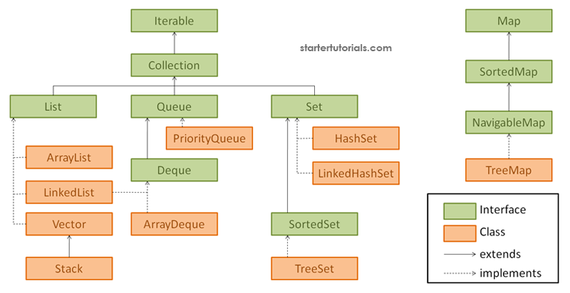
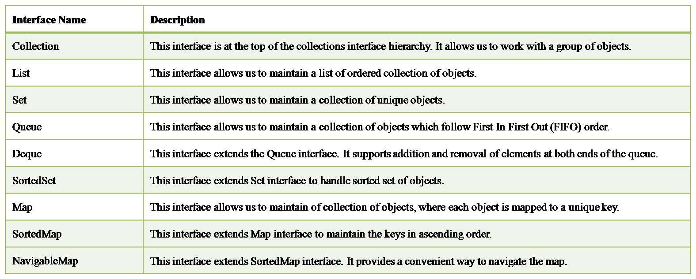
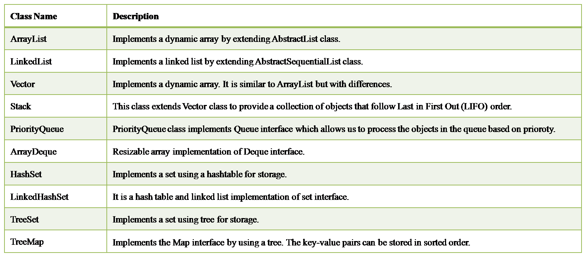

<h3>Collection Framework</h3>

What is Java Collection Framework?

    A Java collection framework provides an architecture to store and manipulate a group of objects. 
    A Java collection framework includes the following:
        1. Interfaces
        2. Classes
        3. Algorithm

Why to use Java Collection Framework?

    There are several benefits of using Java collections such as:

        1. Reducing the effort required to write the code by providing useful data structures and algorithms
        2. Java collections provide high-performance and high-quality data structures and algorithms thereby increasing the speed and quality
        3. Unrelated APIs can pass collection interfaces back and forth
        4. Decreases extra effort required to learn, use, and design new API’s
        5. Supports reusability of standard data structures and algorithms

**Interfaces**

**Classes**

