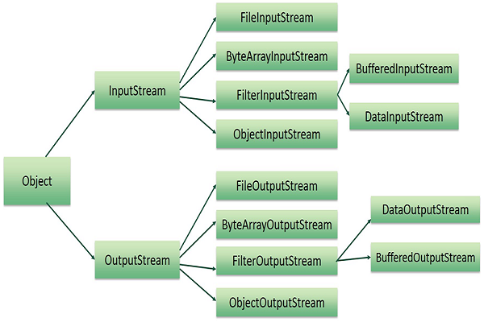

<b>A stream can be defined as a sequence of data.</b> 
 There are two kinds of Streams −

    1. InputStream − The InputStream is used to read data from a source.
    2. OutputStream − The OutputStream is used for writing data to a destination.

Java provides strong but flexible support for I/O related to files and networks.

**Byte Streams**
    
    Java byte streams are used to perform input and output of 8-bit bytes. 
    Though there are many classes related to byte streams 
    but the most frequently used classes are:
        1. FileInputStream 
        2. FileOutputStream

**Character Streams**
    
    Java Byte streams are used to perform input and output of 8-bit bytes, 
    whereas Java Character streams are used to perform input and output for 16-bit unicode. 
    Though there are many classes related to character streams 
    but the most frequently used classes are: 
        1. FileReader
        2. FileWriter. 
    Though internally FileReader uses FileInputStream and FileWriter uses FileOutputStream 
    but here the major difference is that FileReader reads two bytes at a time and 
    FileWriter writes two bytes at a time.

**Standard Streams**

    All the programming languages provide support for standard I/O where the user's program can 
    take input from a keyboard and then produce an output on the computer screen. If you 
    are aware of C or C++ programming languages, then you must be aware of three standard 
    devices STDIN, STDOUT and STDERR. Similarly, Java provides the following three standard streams:

        Standard Input − This is used to feed the data to user's program and usually a keyboard is used as standard input stream and represented as System.in.
        Standard Output − This is used to output the data produced by the user's program and usually a computer screen is used for standard output stream and represented as System.out.
        Standard Error − This is used to output the error data produced by the user's program and usually a computer screen is used for standard error stream and represented as System.err.

